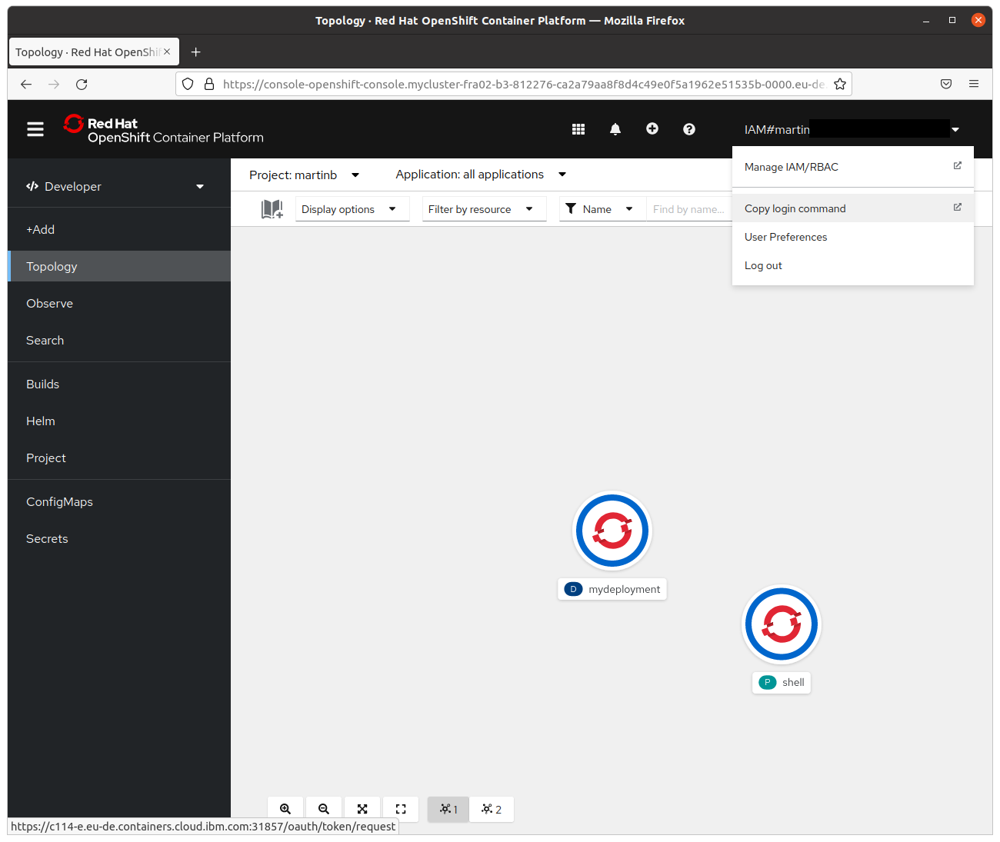

# Kubernetes Example

As a practical example we would like you to deploy the application you are developing this semester on kubernetes and make it accessible via an ingress.

Deliverables:
- Application deployed on openshift in your personal project
  - Frontend application
  - Backend application
  - MongoDB database as simple deployment without persistence (feel free to look into stateful sets and persistence if you are interested)
- Manifests to deploy the application using `kubectl`


Please consider the best practices we discussed regarding building docker images and how to handle environment specific configuration

## Deadline for delivery 12.6.2022 - 12:00


## Additional information

### Openshift access

Everybody should have an IBM cloud account by now and should be able to access the kubernetes cluster https://console-openshift-console.mycluster-fra02-b3-812276-ca2a79aa8f8d4c49e0f5a1962e51535b-0000.eu-de.containers.appdomain.cloud/

Please don't forget to install the [oc tool](https://console-openshift-console.mycluster-fra02-b3-812276-ca2a79aa8f8d4c49e0f5a1962e51535b-0000.eu-de.containers.appdomain.cloud/command-line-tools) locally which will be needed for the exercise.

Once the tool is installed please authenticate by generating login command (needs to be done every 24h)


The execution should look like this:
```
mbrugger@mbrugger:~ $ oc login --token=sha256~blablablatoken --server=https://c114-e.eu-de.containers.cloud.ibm.com:30221
Logged into "https://c114-e.eu-de.containers.cloud.ibm.com:30221" as "IAM#martin@..." using the token provided.

You have access to 76 projects, the list has been suppressed. You can list all projects with 'oc projects'

Using project "martinb".
```
Afterwards switch to your project using `oc project martinb`

You will find more information about the oc cli in the [oc cli documentation](https://docs.openshift.com/container-platform/4.10/cli_reference/openshift_cli/getting-started-cli.html)

Logging into oc will also generate a kubeconfig which allows you to interact with the kubernetes cluster using standard `kubectl`. oc is just an ehanced version of kubectl with extra features specific to openshift. Both (oc and kubectl) will allow you to perform all standard kubernetes operations.

### Deploying kubernetes manifests

During the presentation we used the `kubectl create` command a lot to demonstrate kubernetes. In real projects it is standard to create kubernetes manifests and track them in GIT.

Store the manifests in a separate folder and apply the whole folder by running `kubectl apply -f .` in the folder containing the manifests.

This is a sample deployment of the whoami application

deployment.yaml:
```
apiVersion: apps/v1
kind: Deployment
metadata:
  name: whoami
spec:
  selector:
    matchLabels:
      app: whoami
  template:
    metadata:
      labels:
        app: whoami
    spec:
      containers:
      - name: whoami
        image: containous/whoami
        command:
        - /whoami
        - --port
        - "8080"
```    
service.yaml:
```
apiVersion: v1
kind: Service
metadata:
  labels:
    app: whoami
  name: whoami
spec:
  type: ClusterIP
  ports:
  - port: 8080
    protocol: TCP
    targetPort: 8080
  selector:
    app: whoami
  sessionAffinity: None
```

ingress.yaml (please use your own project name as first component of the hostname **NOT martinb-whoami!**)
```
apiVersion: networking.k8s.io/v1
kind: Ingress
metadata:
  name: whoami
spec:
  rules:
  - host: martinb-whoami.mycluster-fra02-b3-812276-ca2a79aa8f8d4c49e0f5a1962e51535b-0000.eu-de.containers.appdomain.cloud
    http:
      paths:
      - backend:
          service:
            name: whoami
            port:
              number: 8080
        path: /
        pathType: Prefix
```

Afterwards you should be able to access your application via http://martinb-whoami.mycluster-fra02-b3-812276-ca2a79aa8f8d4c49e0f5a1962e51535b-0000.eu-de.containers.appdomain.cloud/

Please also check the [official kubernetes documentation](https://kubernetes.io/docs/home/) in case you have questions about kubernetes manifests.


### Deploying custom built Docker images

Your task will include building and deploying custom docker images.

Please see the [Docker tutorial](https://docs.docker.com/get-started/) for details on how to build a docker image

Openshift has a built-in image registry we are going to use.

Login to the openshift image registry:

```
docker login -u `oc whoami` -p `oc whoami --show-token` default-route-openshift-image-registry.mycluster-fra02-b3-812276-ca2a79aa8f8d4c49e0f5a1962e51535b-0000.eu-de.containers.appdomain.cloud
```

Once you have built your local image it needs to be imported to the registry. Tag your image by adding the registry and your project name
e.g. `docker tag $image:$tag $registry/$project/$image:tag`

For demonstration purposes I will tag the `alpine:3.16.0` image to be pushed to the openshift registry

```
docker tag alpine:3.16.0 default-route-openshift-image-registry.mycluster-fra02-b3-812276-ca2a79aa8f8d4c49e0f5a1962e51535b-0000.eu-de.containers.appdomain.cloud/martinb/alpine:3.16.0
```

Then push the newly tagged image

```
docker push default-route-openshift-image-registry.mycluster-fra02-b3-812276-ca2a79aa8f8d4c49e0f5a1962e51535b-0000.eu-de.containers.appdomain.cloud/martinb/alpine:3.16.0
```


Afterwards the image is in the internal registry and can be referenced in your deployments using the *internal registry name*: `image-registry.openshift-image-registry.svc:5000/martinb/alpine:3.16.0`
```
kubectl run -i -t --image=image-registry.openshift-image-registry.svc:5000/martinb/alpine:3.16.0 myshell
```